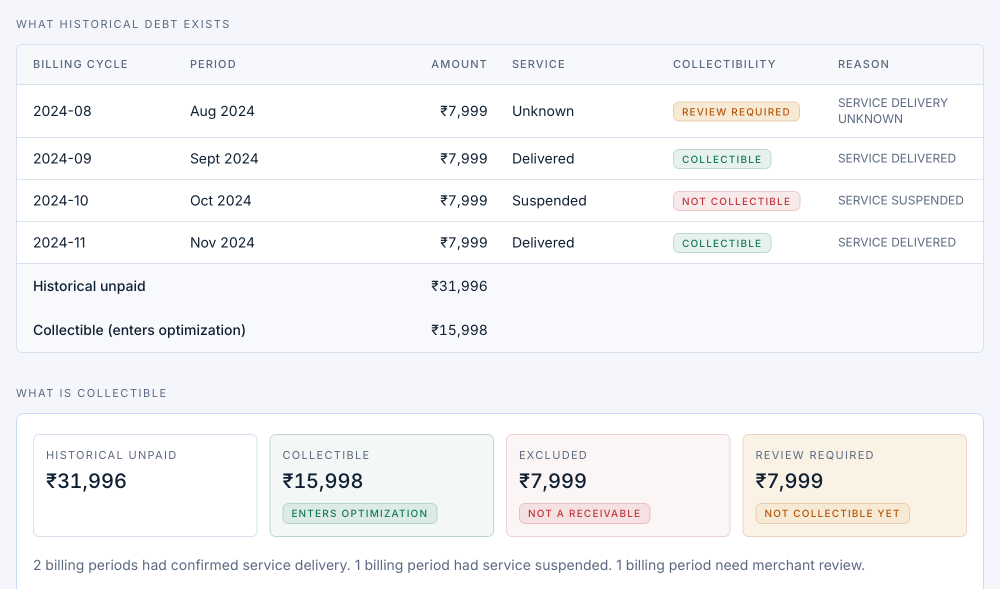

<div align="center">

# AfterDue

**The subscription came back. The old revenue didn't.**

Post-halt revenue intelligence for subscriptions.

<br/>

> Most recovery systems optimize the failure.
>
> **AfterDue starts after the recovery lifecycle is already over.**

<br/>

`POST-HALT` · `COLLECTIBILITY-AWARE` · `UPLIFT` · `POLICY-GATED` · `BOUNDED` · `AUDITABLE`

</div>

Everyone is optimizing the failed payment. **AfterDue is built for what gets left behind.**

Synthetic prototype for Razorpay AI Buildathon Track 03 — not an official Razorpay product. Figures below are from a seeded laboratory. Execution is simulated. Internal strategy id: `reclaim`.

---

## The ₹31,996 problem

A customer returns after a halted period. Their ledger still contains:

### ₹31,996 in historical unpaid invoices

The obvious question:

> How do we recover ₹31,996?

AfterDue asks first:

> **How much of that ₹31,996 should we even attempt to recover?**

An unpaid invoice proves that an invoice exists. It does not prove the merchant delivered the service.

| Historical invoice | Service evidence | AfterDue |
|---|---|---|
| ₹7,999 | Unknown | Review required |
| ₹7,999 | Delivered | Collectible |
| ₹7,999 | Suspended | Excluded |
| ₹7,999 | Delivered | Collectible |

### ₹31,996 historical unpaid → ₹15,998 collectible

Review-required money is not collectible. Excluded money is not lost recovery — it was not a valid receivable.

**Only then does recovery optimization begin.**

This is a real case from the canonical seed-42 world (`Priya 0064`): four ₹7,999 halt invoices, same split as the table.



---

## Typical recovery vs AfterDue

Conceptual comparison. Not a benchmark of other Buildathon projects.

| Typical recovery agent | AfterDue |
|---|---|
| Starts when payment fails | Starts when the customer returns |
| Sees an unpaid invoice | Asks whether it is collectible |
| Predicts likelihood to pay | Estimates the incremental effect of acting |
| Optimizes attempted recovery | Optimizes collectible incremental ₹ |
| Chooses an action | Revalidates immediately before execution |
| Stops after the retry lifecycle | Operates on the revenue left behind |

---

## How AfterDue works

```text
Customer returns
       │
       ▼
Historical unpaid ledger
       │
       ▼
┌─────────────────────┐
│   COLLECTIBILITY    │  Is this receivable valid?
└──────────┬──────────┘
           ▼
┌─────────────────────┐
│       POLICY        │  What are we allowed to do?
└──────────┬──────────┘
           ▼
┌─────────────────────┐
│  UPLIFT + ECONOMICS │  Does acting create incremental ₹?
└──────────┬──────────┘
           ▼
┌─────────────────────┐
│     VALIDATION      │  Is it still safe to act?
└──────────┬──────────┘
           ▼
     Bounded action → Audit trail
```

What exists in this repo: event ledger and halt episodes, lineage-based unpaid reconstruction, collectibility gate, deterministic policy, uplift model, bounded agent, simulated executor, append-only audit, and a judge-facing console. Trigger is `HALTED → ACTIVE`. Full design: [`docs/architecture.md`](docs/architecture.md).

`UNKNOWN` service delivery fails closed to review and never enters ranking or the agent. AfterDue cannot infer live merchant entitlement from payment events; production evidence would come from the merchant or manual confirmation.

It does not rank `P(payment)`. On collectible debt only:

```text
uplift(A) = P(recovery | A) − P(recovery | no_action)
incremental_ev_paise(A) = round(backlog_amount_paise × uplift(A) − cost(A))
```

After the gate, `backlog_amount_paise` is collectible eligible receivable. `NO_ACTION` EV is `0`. UI says “estimated intervention lift,” never “AI confidence.”

Policy is deterministic and provenanced (documented platform behavior / product design assumption / safety guardrail). Cited Razorpay rule: [manual charging of a domestic card is not supported](https://razorpay.com/docs/payments/subscriptions/payment-retries/). The agent revalidates immediately before **simulated** execution (idempotency, cooldown, max attempts, TOCTOU). Claude may explain; it does not decide money. Details: [`docs/policy.md`](docs/policy.md), [`docs/agent.md`](docs/agent.md).

This laboratory models leftover halt-period invoices that remain after the customer returns. It is not a failed-payment retry classifier, and it is not a Razorpay production feature.

---

## Evaluation

One seeded world, one policy, one oracle, one intervention budget. Only the decision rule changes.

Canonical run after the collectibility gate: `subscriber_count=100`, `seed=42`, `intervention_budget=25`.

Funnel: historical unpaid ₹16,71,822 → collectible ₹8,42,415 · review ₹5,67,448 · excluded ₹2,61,959. 23 collectible cases (3 review-only cases sit outside the strategy universe).

| Strategy | Rule | Recovered | Incremental | Yield | Used |
|---|---|---:|---:|---:|---:|
| Naive | First allowed action, encounter order | ₹5,53,459 | ₹2,95,483 | 65.70% | 16 |
| Rule-based | Heuristic score, same actions and budget | ₹5,53,459 | ₹2,95,483 | 65.70% | 16 |
| AfterDue (`reclaim`) | Model incremental EV, same policy and budget | ₹5,53,459 | ₹2,95,483 | 65.70% | 16 |

**That tie is the result.** The simulator was not retuned so AfterDue would win. Yield is recovered / collectible eligible, not raw historical unpaid. Synthetic, not Razorpay production statistics. Methodology: [`docs/evaluation.md`](docs/evaluation.md). Model/calibration: [`docs/model.md`](docs/model.md).

---

## Run it

```bash
git clone https://github.com/fahad2707/reclaim.git && cd reclaim
make setup          # then put MONGODB_URI in .env
make backend        # http://127.0.0.1:8000
make frontend       # http://localhost:3000
make demo-reset     # canonical 100 / seed 42 / budget 25 (backend must be up)
```

First visit opens the product tour. `/?guide=1` walks the live console.

Judge path: Overview (unpaid vs collectible) → Recovery cases (click any row) → Collectibility panel → Policy provenance → Model estimates → simulated execute. Evaluation at `/evaluation` is an in-memory collectibility benchmark and does not write Mongo.

Walkthrough: [`docs/demo-script.md`](docs/demo-script.md). Deploy: [`docs/deployment.md`](docs/deployment.md).

```bash
make check && make test
```

---

## Limitations

Synthetic data and oracle only. No production Razorpay connection, no real charge or messaging APIs, no partial settlement. AfterDue cannot infer live service delivery from payment events. What broke while building it: [`docs/incidents.md`](docs/incidents.md).

**Docs:** [architecture](docs/architecture.md) · [policy](docs/policy.md) · [model](docs/model.md) · [evaluation](docs/evaluation.md) · [agent](docs/agent.md) · [deployment](docs/deployment.md)

**Built with:** Python · FastAPI · MongoDB · Next.js · scikit-learn · optional Claude. The economic comparison is identical with Claude off.
